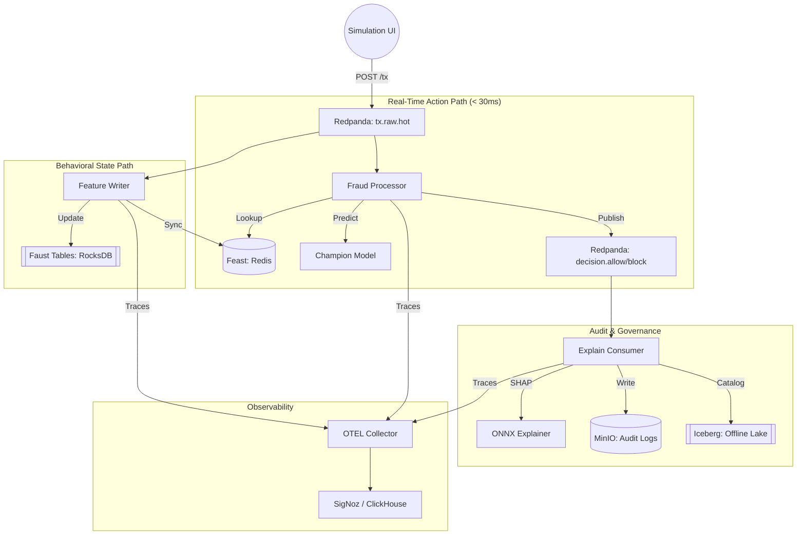

# 🛠️ Fraud Detection Services - Data Engineering Guide

This document provides a deep dive into the real-time behavioral fraud detection engine. As a Data Engineer, you can think of this system as a **Low-Latency Streaming Data Lake**.

---

## 🏗️ System Architecture & Data Flow

---

## 📂 Service Deep-Dive

### 1. Fraud Processor (`/services/fraud-processor`)
*   **Role:** Inference Engine.
*   **Input:** `TransactionEvent` via Kafka.
*   **Logic:**
    1.  **Hydrate:** Joins the incoming `account_id` with historical features from **Feast** (Redis).
    2.  **Score:** Passes the combined vector to **ONNX Runtime**.
    3.  **Route:** Dispatches a `DecisionEnvelope` to the appropriate topic.
*   **Stack:** Faust, Feast SDK, ONNX Runtime.

### 2. Feature Writer (`/services/feature-writer`)
*   **Role:** Streaming Aggregator (Stateful).
*   **Input:** `TransactionEvent` via Kafka.
*   **Logic:**
    1.  **Aggregate:** Increments transaction counts in a **Faust Table** (RocksDB).
    2.  **Materialize:** Every event triggers an "Online Store" update to Feast so the **Fraud Processor** has fresh data.
*   **Stack:** Faust, Pandas, Feast.

### 3. Explain Consumer (`/services/explain-consumer`)
*   **Role:** Model Interpretability & Archival.
*   **Input:** `tx.raw.hot` (and ideally joins with decisions).
*   **Logic:**
    1.  **Explain:** Uses a specialized ONNX model to calculate "SHAP values" (why the model picked a score).
    2.  **Persist:** Saves a JSON report to **MinIO** for EU AI Act audit compliance.
*   **Stack:** Boto3, ONNX.

### 4. Drift Monitor (`/services/drift-monitor`)
*   **Role:** Data Quality Guard.
*   **Input:** `tx.raw.hot`.
*   **Logic:** Compares windowed averages of transaction amounts against a baseline. If the distribution shifts, it alerts.
*   **Stack:** Faust Windowing.

---

## 🔧 Operational Commands

To manage all services across all profiles (Core, Observability, Management):

| Command | Action |
| :--- | :--- |
| `make all-up` | Starts EVERYTHING (Bus, UI, SigNoz, Airflow, MLflow). |
| `make all-down` | Stops everything and cleans up networks. |
| `make all-logs` | Tails logs from all active containers. |
