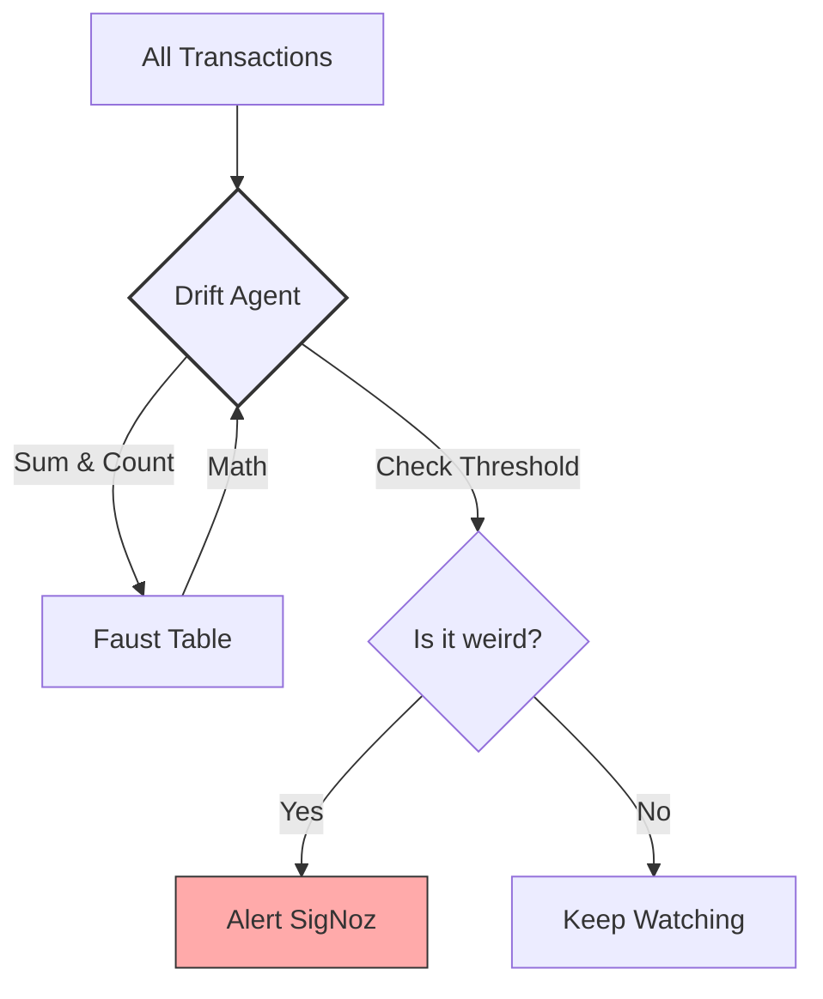

# 📈 Drift Monitor Service

The **Lookout** of the system. This service doesn't block transactions; instead, it watches for long-term changes in behavior (Drift) that might mean our ML models are becoming outdated.

## 🛠️ Technology: Faust & OTel

- **Faust Tables:** Keeps track of global averages and counts over time.
- **OpenTelemetry (OTel):** A standard way to send performance data and alerts to monitoring tools like SigNoz or Prometheus.

## 📝 What this code does

1.  **Monitors:** It listens to all incoming transactions on `tx.raw.hot`.
2.  **Calculates:** It computes a **Rolling Average** of transaction amounts. If normally people spend $50, but suddenly everyone is spending $1000, that's "Drift".
3.  **Alerts:** If the average crosses a safe threshold, it logs a warning and emits a metric to **SigNoz**.

## 🎨 Architecture (Hand-Drawn Style)

## 📋 Example

**Normal State:**
- Total Transactions: 1000
- Average Amount: **$45.00**

**Drift Event:**
- A surge of $500 transactions arrives.
- New Rolling Average: **$105.00**
- **Threshold:** $100.00
- **Action:** `WARNING: DRIFT DETECTED!` sent to dashboards.
