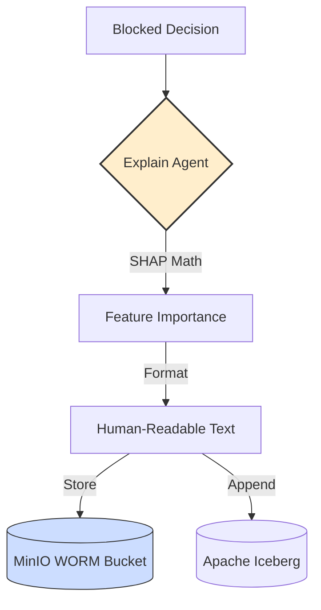

# 🧐 Explain Consumer Service

The **Auditor** of the system. This service works in the background (Cold Path) to explain *why* high-risk decisions were made. This is critical for legal compliance (like the EU AI Act).

## 🛠️ Technology: SHAP & Apache Iceberg

- **SHAP (Lite):** A mathematical method to explain ML model outputs. It says, "The score is high because the 'txn_count' was huge, not because of the 'country'."
- **Apache Iceberg:** A high-performance table format for big data. It ensures that our audit logs are organized, searchable, and unchangeable.

## 📝 What this code does

1.  **Captures:** It listens for high-risk decisions (blocks or reviews).
2.  **Analyzes:** It re-runs a specialized version of the model to compute **Feature Importance** (SHAP values).
3.  **Logs:** It writes a detailed JSON explanation to the **Audit Bucket (MinIO)** and saves the record to the **Iceberg Data Lake**.

## 🎨 Architecture (Hand-Drawn Style)



## 📋 Example

**Input:** Transaction `tx_abc` was blocked.

**Calculation:**
- Feature `txn_count_1m` contributed **+0.7** to the risk.
- Feature `amount_cents` contributed **+0.1** to the risk.

**Audit Log:**
```json
{
  "transaction_id": "tx_abc",
  "explanation": "Blocked due to high velocity (txn_count_1m)",
  "compliance_id": "DORA-2026-X"
}
```
