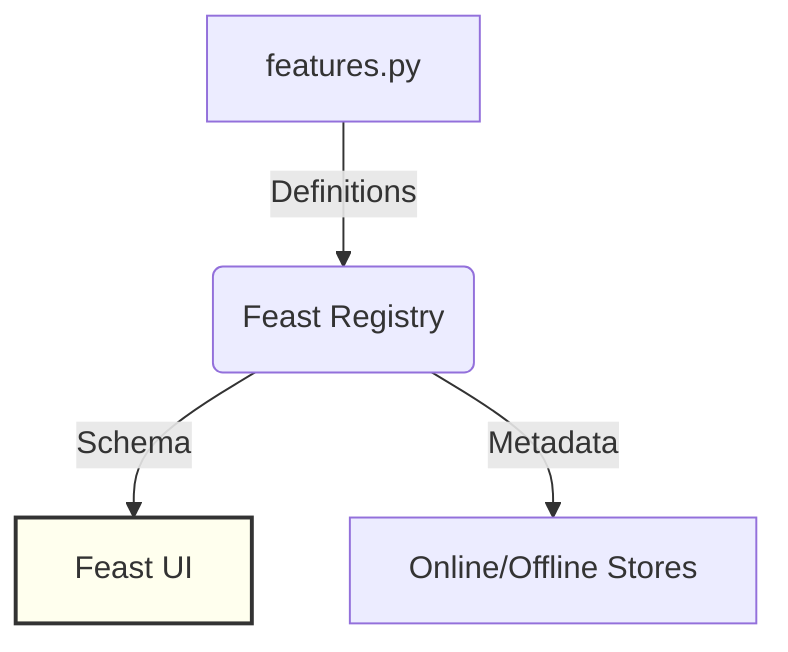

# 🍽️ Feast Service

The **Kitchen** of the system. This service doesn't process transactions directly; it hosts the **Feast UI** and manages the definitions of our behavioral features.

## 🛠️ Technology: Feast

- **Feast UI:** A web dashboard where you can see all the "Feature Views" (the data recipes) we've created.
- **Feast Registry:** A catalog that keeps track of where data is stored (Redis for real-time, MinIO for history).

## 📝 What this code does

1.  **Serves the UI:** Runs on port `6566` so you can browse the feature catalog.
2.  **Manages Definitions:** Uses the `features.py` file to know what a "Transaction Count" or "Spend Sum" looks like.

## 🎨 Architecture (Hand-Drawn Style)

## 📋 Example

When you open the Feast UI, you can see the **account_velocity** feature view. It lists:
- `txn_count_1m` (Float64)
- `spend_sum_1h` (Float64)
- `distinct_merchants_1h` (Int32)

This ensures everyone—from the Data Scientist to the Software Engineer—is using the same definition of "Velocity."
