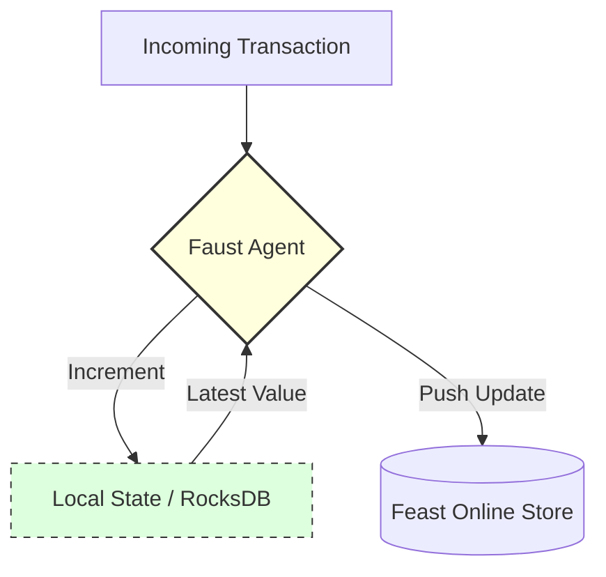

# ✍️ Feature Writer Service

The **Scribe** of the system. This service keeps the Feature Store up-to-date with every heartbeat of the system. It ensures that when the Brain (Fraud Processor) asks a question, the answer is fresh.

## 🛠️ Technology: Faust & Feast

- **Faust Tables:** Uses an embedded database (RocksDB) inside the app to do math (like counting) extremely fast and safely.
- **Feast (Online Store):** A specialized database for Machine Learning features. It's optimized for reading full vectors in microseconds.

## 📝 What this code does

1.  **Observes:** It watches the `tx.raw.hot` topic for every transaction.
2.  **Counts:** It increments a running counter in a **Faust Table**. This is atomic, meaning it never misses a count even if thousands of transactions happen at once.
3.  **Syncs:** It pushes the latest count (e.g., "Total transactions in the last minute") to the **Feast Online Store (Redis)**.

## 🎨 Architecture (Hand-Drawn Style)

## 📋 Example

**Scenario:**
- Current `txn_count_1m` for `acc_123`: **4**
- A new transaction arrives.

**Code Action:**
1.  Updates local table: `acc_123` count -> **5**
2.  Calls `store.write_to_online_store()` with the new value **5**.

**Result:**
The Fraud Processor now sees that `acc_123` has made **5** transactions, which might trigger a risk alert!
