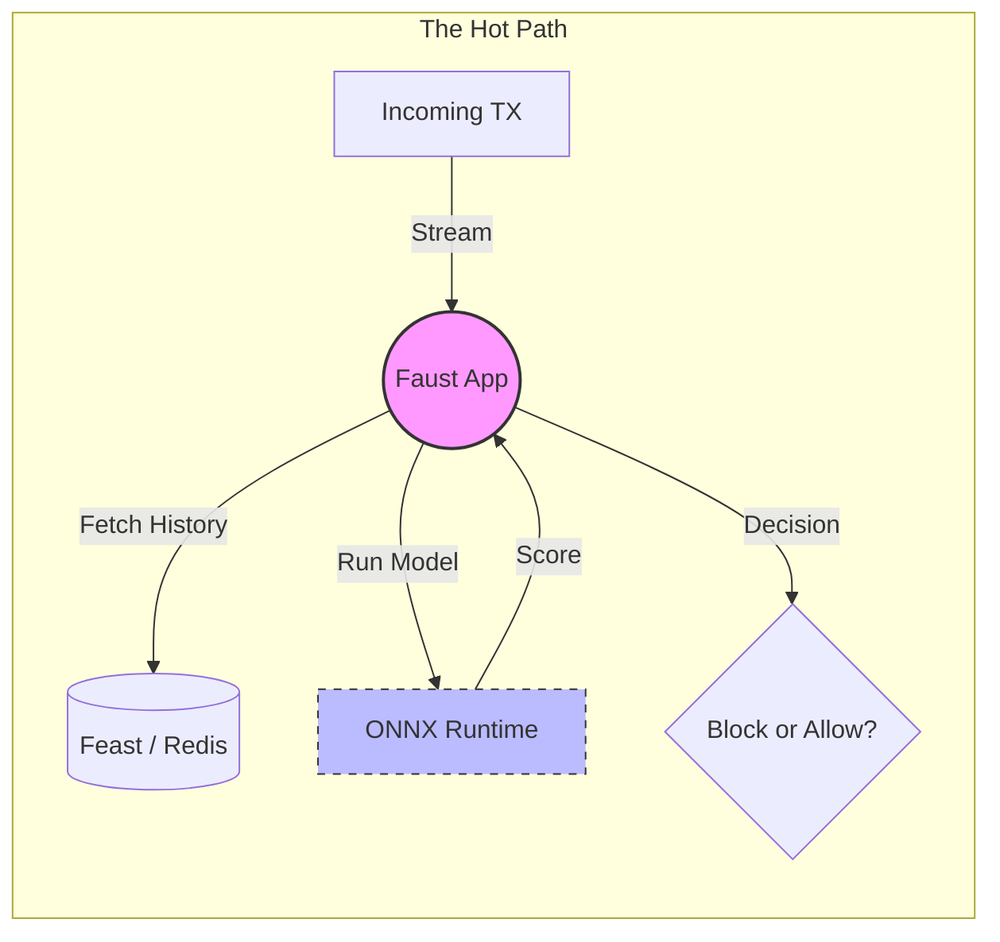

# 🧠 Fraud Processor Service

The **Brain** of the system. This service lives on the "Hot Path" and makes split-second decisions (BLOCK or ALLOW) for every transaction that comes in.

## 🛠️ Technology: Faust & ONNX

- **Faust Streaming:** A Python library that treats Kafka topics like infinite lists. It processes events as they arrive, with no waiting.
- **ONNX Runtime:** A high-performance engine for running Machine Learning models. It's like a universal translator for models trained in PyTorch, TensorFlow, or Scikit-Learn.

## 📝 What this code does

1.  **Listens:** It waits for new transactions on the `tx.raw.hot` topic.
2.  **Hydrates:** It asks the **Feast Feature Store** for the account's history (e.g., "How many times has this person shopped in the last minute?").
3.  **Predicts:** It feeds the transaction details + history into a **Champion ML Model** (and sometimes a Challenger model) to get a risk score.
4.  **Decides:** Based on thresholds (e.g., score > 0.7), it sends a decision to `decision.block` or `decision.allow`.

## 🎨 Architecture (Hand-Drawn Style)



## 📋 Example

**Input Transaction:**
```json
{
  "account_id": "acc_777",
  "amount_cents": 9900,
  "event_timestamp": 1713110400000
}
```

**Feature Hydration:**
- `txn_count_1m`: 15 (Wait, that's high!)

**Inference Result:**
- `risk_score`: 0.85

**Final Action:**
- **Topic:** `decision.block`
- **Reason:** `velocity_burst` detected by Champion model.
