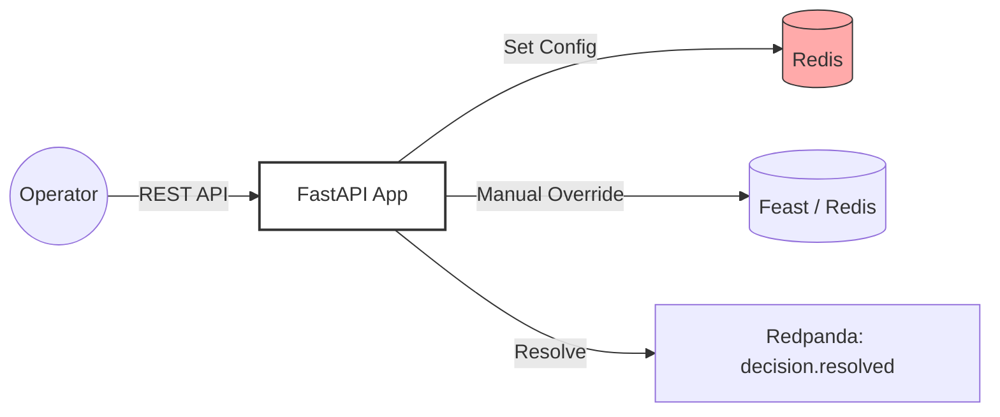

# 🕹️ Management API Service

The **Control Center** of the system. This service provides the "buttons and knobs" for operators to manage the engine without touching the core streaming code.

## 🛠️ Technology: FastAPI & Redis

- **FastAPI:** A modern, blazing-fast web framework for building APIs with Python. It's like Flask but with automatic documentation and data validation.
- **Redis:** Used here as a high-speed configuration store. When you change a threshold in the API, the Stream Processors see it instantly.

## 📝 What this code does

1.  **Thresholds:** Allows operators to update risk levels (e.g., "Change BLOCK threshold from 0.7 to 0.8").
2.  **Resolutions:** Provides an endpoint to resolve transactions that were flagged for `REVIEW`.
3.  **Overrides:** Let's you manually force a feature value (e.g., "Reset the transaction count for this VIP account").

## 🎨 Architecture (Hand-Drawn Style)



## 📋 Example

**Update Config:**
`PATCH /config`
```json
{
  "low": 0.4,
  "high": 0.8
}
```
**Effect:** Within 5 seconds, all Fraud Processors will start using these new thresholds!

**Resolve Review:**
`POST /reviews/tx_123/resolve`
```json
{
  "resolution": "APPROVED",
  "reason": "Customer called and verified."
}
```
