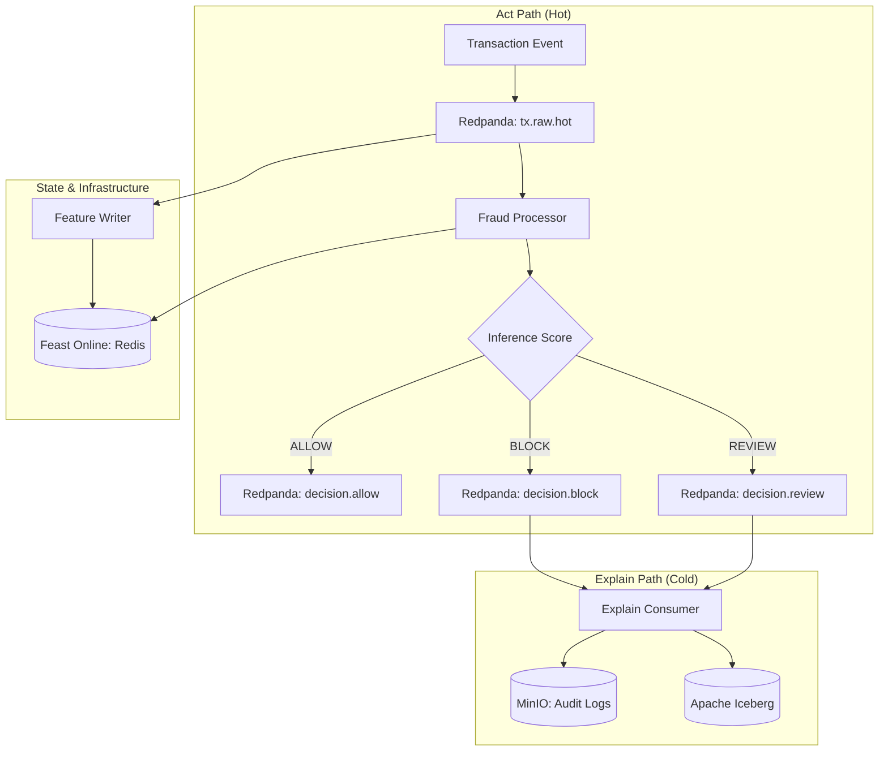
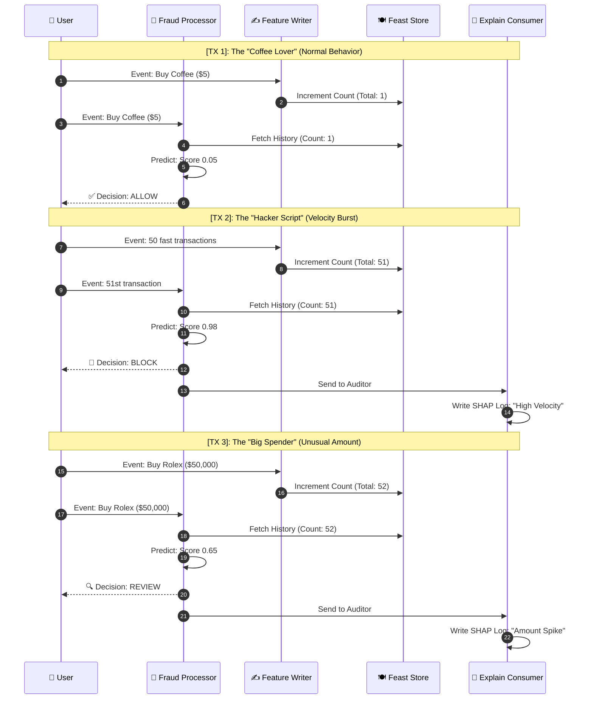

# Real-Time Behavioral Fraud Detection Engine

A high-performance, sub-30ms P99 behavioral fraud detection engine built with a multi-agent, event-driven architecture. The system separates the **hot path** (real-time inference) from the **explain path** (asynchronous auditing and explainability).

## 🚀 Features

- **Sub-30ms Latency:** Optimized hot path using Faust streaming and in-memory caching.
- **Behavioral Analysis:** Real-time feature engineering using **Feast** (Online Store: Redis, Offline Store: MinIO).
- **ML Inference:** sidecar model execution using **ONNX Runtime** (Champion/Challenger routing).
- **Observability:** Full-stack telemetry with **OpenTelemetry**, **SigNoz**, and **Prometheus**.
- **Governance:** Immutable audit logs via MinIO WORM buckets and **Apache Iceberg**.
- **Management API:** FastAPI for manual review overrides and dynamic risk thresholds.

## 🏗️ Architecture

## 🎥 Live Flow: 3-Transaction Playback

This sequence walks through three specific scenarios:
1. **✅ ALLOW:** Normal "Coffee Lover" behavior.
2. **🛑 BLOCK:** "Hacker Script" velocity burst (51 fast transactions).
3. **🔍 REVIEW:** "Big Spender" unusual amount (Rolex purchase).

## 🧩 Roles & Responsibilities: Who does what?

Understanding the difference between behavioral tracking, system monitoring, and manual judging:

| Component | Responsibility | Scope | Logic Trigger |
| :--- | :--- | :--- | :--- |
| **✍️ Feature Writer** | **Behavioral Tracking.** Updates the history of a *specific* account (e.g., "This user has 5 txns in 1 min"). | **Individual** | `account_tx_counts[id] += 1` on every event. |
| **📈 Drift Monitor** | **System Health.** Detects if *global* spending patterns have shifted away from what the model was trained on. | **Global** | `new_avg = (total + amount) / count`. |
| **🧠 Fraud Processor**| **The Decider.** Combines the user's history with the current transaction to give a 0-1 risk score. | **Transactional** | `champion.predict(features)` for every event. |
| **🕹️ Management API** | **Human-in-the-Loop.** Allows operators to manually approve `REVIEW` cases or update risk thresholds. | **Administrative** | Manual HTTP `PATCH /config` request. |

---

## 🛠️ Tech Stack

- **Message Bus:** [Redpanda](https://redpanda.com/) (Kafka-compatible)
- **Stream Processing:** [Faust Streaming](https://github.com/robinhood/faust)
- **Feature Store:** [Feast](https://feast.dev/)
- **Model Runtime:** [ONNX Runtime](https://onnxruntime.ai/)
- **Object Storage:** [MinIO](https://min.io/)
- **Observability:** [SigNoz](https://signoz.io/) / [OpenTelemetry](https://opentelemetry.io/)
- **API Framework:** [FastAPI](https://fastapi.tiangolo.com/)

## 🏁 Getting Started

### Quick Start

1.  **Enter the project directory:** `cd "Fraud Detection"`
2.  **Infrastructure:** `make core`
3.  **Bootstrap:** `make topics` and `make buckets`
4.  **Full Stack:** `make obs`
5.  **Simulate:** `make sim-anomaly`

### Real-Time UI Monitoring

| UI | URL | Purpose |
| :--- | :--- | :--- |
| **Redpanda Console** | [http://localhost:8080](http://localhost:8080) | **View Live Transactions.** See `decision.block` envelopes in real-time. |
| **SigNoz** | [http://localhost:3301](http://localhost:3301) | **Latency Tracing.** Search for `fraud-processor` traces. |
| **Feast UI** | [http://localhost:6566](http://localhost:6566) | **Feature State.** Monitor `txn_count_1m` values. |

## 📁 Repository Structure

- `Fraud Detection/services`: Individual micro-agents (fraud-processor, feature-writer, etc.)
- `Fraud Detection/config`: Component configurations (Feast, Redis, Redpanda, OTel)
- `Fraud Detection/schemas`: Avro schema definitions for event versioning
- `Fraud Detection/docs`: Technical specifications and architectural deep-dives
- `Fraud Detection/reviews`: Historical code review summaries indexed by commit hash

## ⚖️ Governance & Compliance

This engine is designed to comply with **DORA** and the **EU AI Act**:
- **Explainability:** Asynchronous SHAP value computation for high-risk decisions.
- **Auditability:** Immutable WORM storage for all decision envelopes in MinIO.
- **Human-in-the-Loop:** `REVIEW` decision class for manual operator intervention via Management API.
