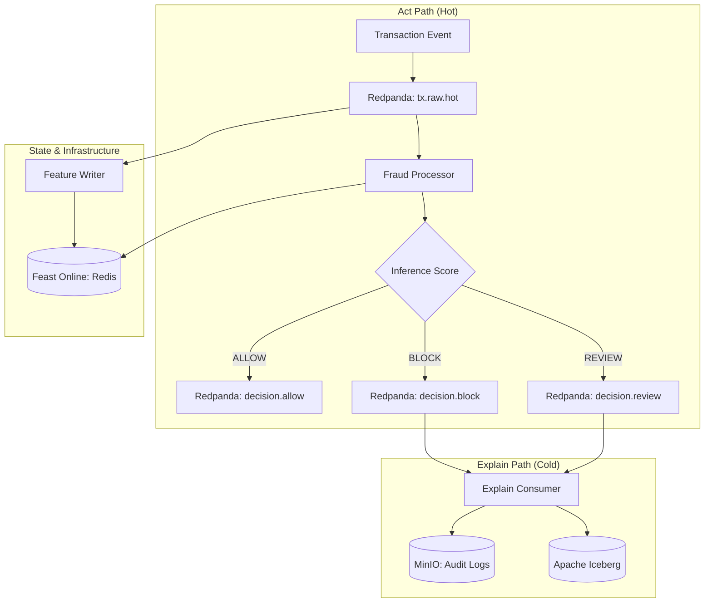

# Real-Time Behavioral Fraud Detection Engine

A high-performance, sub-30ms P99 behavioral fraud detection engine built with a multi-agent, event-driven architecture. The system separates the **hot path** (real-time inference) from the **explain path** (asynchronous auditing and explainability).

## 🚀 Features

- **Sub-30ms Latency:** Optimized hot path using Faust streaming and in-memory caching.
- **Behavioral Analysis:** Real-time feature engineering using **Feast** (Online Store: Redis, Offline Store: MinIO).
- **ML Inference:** sidecar model execution using **ONNX Runtime** (Champion/Challenger routing).
- **Observability:** Full-stack telemetry with **OpenTelemetry**, **SigNoz**, and **Prometheus**.
- **Governance:** Immutable audit logs via MinIO WORM buckets and **Apache Iceberg**.
- **Management API:** FastAPI for manual review overrides and dynamic risk thresholds.

## 🏗️ Architecture



## 🛠️ Tech Stack

- **Message Bus:** [Redpanda](https://redpanda.com/) (Kafka-compatible)
- **Stream Processing:** [Faust Streaming](https://github.com/robinhood/faust)
- **Feature Store:** [Feast](https://feast.dev/)
- **Model Runtime:** [ONNX Runtime](https://onnxruntime.ai/)
- **Object Storage:** [MinIO](https://min.io/)
- **Observability:** [SigNoz](https://signoz.io/) / [OpenTelemetry](https://opentelemetry.io/)
- **API Framework:** [FastAPI](https://fastapi.tiangolo.com/)

## 🏁 Getting Started

### Prerequisites

- Docker Desktop / Docker Engine with Compose V2
- Python 3.11+
- `rpk` (Redpanda CLI) - Optional, for inspection

### Quick Start

1. **Enter the project directory:**
   ```bash
   cd "Fraud Detection"
   ```

2. **Start the core infrastructure:**
   ```bash
   make core
   ```

3. **Bootstrap topics and buckets:**
   ```bash
   make topics
   make buckets
   ```

4. **Start the full stack (including observability):**
   ```bash
   make obs
   ```

## 🧪 Testing & Real-Time Monitoring

### 1. Register Schemas
Register Avro schemas with the built-in Redpanda Schema Registry:
```bash
make schemas
```

### 2. Run Simulations
Generate transactions to see the engine in action:
- **Normal Traffic (Happy Path):**
  ```bash
  make sim-normal
  ```
- **Anomaly Traffic (Triggers Blocks/Reviews):**
  ```bash
  make sim-anomaly
  ```

### 3. Real-Time UI Monitoring

| UI | URL | Purpose |
| :--- | :--- | :--- |
| **Redpanda Console** | [http://localhost:8080](http://localhost:8080) | **View Live Transactions.** Navigate to `Topics -> decision.block` to see fraud detections in real-time. |
| **SigNoz** | [http://localhost:3301](http://localhost:3301) | **Latency Tracing.** Search for `fraud-processor` traces to see microsecond breakdowns. |
| **Feast UI** | [http://localhost:6566](http://localhost:6566) | **Feature State.** Monitor real-time behavioral features like `txn_count_1m`. |

### 4. Example Payloads

**Incoming Transaction (`tx.raw.hot`):**
```json
{
  "transaction_id": "550e8400-e29b-41d4-a716-446655440000",
  "account_id": "acc_12345",
  "amount_cents": 50000,
  "merchant_id": "merch_99",
  "country_code": "US",
  "event_timestamp": 1713110400000
}
```

**Fraud Decision (`decision.block`):**
```json
{
  "transaction_id": "550e8400-e29b-41d4-a716-446655440000",
  "decision": "BLOCK",
  "risk_score": 0.92,
  "model_version": "champion-v1",
  "flags": ["velocity_burst"]
}
```

## 📁 Repository Structure

- `Fraud Detection/services`: Individual micro-agents (fraud-processor, feature-writer, etc.)
- `Fraud Detection/config`: Component configurations (Feast, Redis, Redpanda, OTel)
- `Fraud Detection/schemas`: Avro schema definitions for event versioning
- `Fraud Detection/docs`: Technical specifications and architectural deep-dives
- `Fraud Detection/reviews`: Historical code review summaries indexed by commit hash

## ⚖️ Governance & Compliance

This engine is designed to comply with **DORA** and the **EU AI Act**:
- **Explainability:** Asynchronous SHAP value computation for high-risk decisions.
- **Auditability:** Immutable WORM storage for all decision envelopes in MinIO.
- **Human-in-the-Loop:** `REVIEW` decision class for manual operator intervention via Management API.
